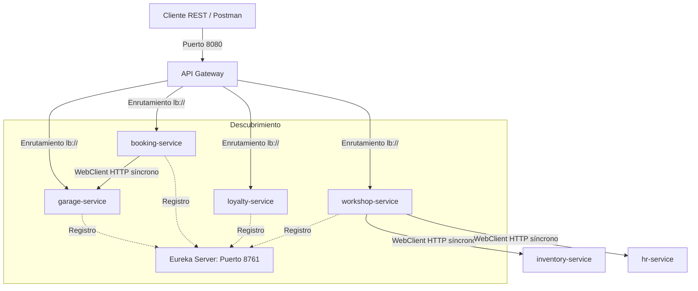

# Documentación de Microservicios: Arquitectura AutoCare

Este documento describe detalladamente la responsabilidad de cada microservicio dentro del ecosistema **AutoCare** y cómo se comunican y coordinan entre sí para garantizar un sistema desacoplado, escalable y tolerante a fallos.

---

## 1. Catálogo de Microservicios

El universo de **AutoCare** está compuesto por 11 servicios de negocio independientes y 2 componentes clave de infraestructura.

### 🛠️ Componentes de Infraestructura
*   **`eureka-server` (Puerto 8761):** Servidor de descubrimiento (Netflix Eureka). Es el directorio telefónico del sistema; todos los microservicios se registran aquí al arrancar para que el resto pueda localizarlos dinámicamente sin cablear IPs o puertos físicos.
*   **`api-gateway` (Puerto 8080):** Puerta de enlace centralizada de la API (Spring Cloud Gateway). Expone una única URL pública, enruta el tráfico hacia los microservicios correspondientes de forma balanceada (`lb://`) y gestiona las solicitudes de CORS y seguridad.

### 👤 Servicios del Dominio del Cliente y Atención
*   **`garage-service` (Puerto 8081):** Gestiona el inventario de clientes y sus vehículos (Entidades `Cliente` y `Vehiculo`). Es la fuente de verdad de la información técnica del auto (marca, modelo, patente, VIN) y datos de contacto del dueño.
*   **`booking-service` (Puerto 8085):** Administra el agendamiento y calendario de citas para el taller (`Cita`). Valida reglas de negocio de fecha/hora (horas laborables, no duplicidad de citas) y provee hipermedios HATEOAS.
*   **`loyalty-service` (Puerto 8088):** Gestiona los perfiles de fidelización (`PerfilLealtad`). Registra la acumulación y canje de puntos de los clientes y actualiza dinámicamente su nivel (Bronce, Plata, Oro, VIP) en base a su consumo.

### 🛠️ Servicios de Dominio del Taller y Operaciones
*   **`diagnostics-service` (Puerto 8083):** Encargado de las inspecciones visuales iniciales de los autos al ingresar al taller, registrar daños, kilometraje y generar diagnósticos con presupuestos estimativos.
*   **`workshop-service` (Puerto 8082):** El corazón de la operación del taller. Gestiona las Órdenes de Trabajo (OT) y su transición por los diferentes estados del flujo (En Espera, En Proceso, Control de Calidad, Listo para Entrega).
*   **`hr-service` (Puerto 8086):** Administra la información del personal del taller (especialidades mecánicas y su disponibilidad actual) para permitir la asignación óptima de técnicos a las órdenes de trabajo.

### 📦 Servicios de Dominio de Suministros e Inventario
*   **`inventory-service` (Puerto 8084):** Controla el inventario de bodega de repuestos (códigos de piezas, stocks, precio unitario, ubicación). Permite a otros servicios reservar piezas para presupuestos en curso.
*   **`procurement-service` (Puerto 8090):** Gestiona las órdenes de compra y cotizaciones con proveedores externos cuando se detecta stock crítico de algún repuesto en bodega.

### 💰 Servicios Financieros, Alertas y Métricas (Transversales)
*   **`billing-service` (Puerto 8087):** Gestiona la facturación, los métodos de pago y el cierre comercial de las órdenes de trabajo.
*   **`notification-service` (Puerto 8089):** Servicio CRM encargado de enviar notificaciones multi-canal (Email, SMS o alertas internas) a los clientes sobre el estado de su vehículo ("Cita agendada", "Presupuesto listo para aprobación", "Vehículo reparado").
*   **`analytics-service` (Puerto 8091):** Recolecta métricas operacionales del taller (tiempos promedio de reparación, ingresos diarios, repuestos más usados) para generar paneles informativos de negocio.

---

## 2. Patrones de Comunicación e Integración

Para asegurar que los microservicios funcionen como un ecosistema unificado sin acoplarse, se aplican las siguientes estrategias:

### A. Descubrimiento Dinámico de Servicios (Eureka)
En lugar de registrar IPs estáticas (`localhost:8081`, `localhost:8085`), los servicios se comunican referenciando el nombre lógico configurado en Spring:
*   Para hablar con `garage-service`, un cliente consume la dirección base `http://garage-service/api/garage/...`.
*   Spring Cloud LoadBalancer intercepta la petición, consulta a Eureka, obtiene la IP/puerto activa y realiza el balanceo automáticamente.

### B. Comunicación HTTP Síncrona No Bloqueante (WebClient)
Cuando un microservicio requiere datos que le pertenecen a otro dominio, realiza llamadas API REST internas usando **`WebClient`**:
*   **Validación de Citas:** Al crear una cita en `booking-service`, éste realiza llamadas REST síncronas hacia `garage-service` para verificar que el `clienteId` y `vehiculoId` existan antes de persistir la cita.
*   **Asignación de Recursos:** `workshop-service` consulta síncronamente al `inventory-service` para validar stock antes de adjuntar repuestos a una orden, y a `hr-service` para verificar la disponibilidad del mecánico asignado.

### C. Desacoplamiento de Datos (Database-per-service)
Cada microservicio es dueño absoluto de sus datos y tiene su propia base de datos física aislada (PostgreSQL/H2). **No existen foreign keys (FK) tradicionales de base de datos entre microservicios.**
*   *Ejemplo:* En la tabla de la base de datos de `booking-service` (Citas), no hay una relación de clave foránea física con la tabla de clientes. En su lugar, se guarda un **"enlace fantasma"** (`clienteId` como tipo primitivo `Long`).
*   La integridad referencial lógica se gestiona a nivel de código de aplicación validando la existencia de la ID remota por medio de APIs REST (usando `WebClient`), garantizando así que una caída en una base de datos no corrompa el esquema global de las otras.
