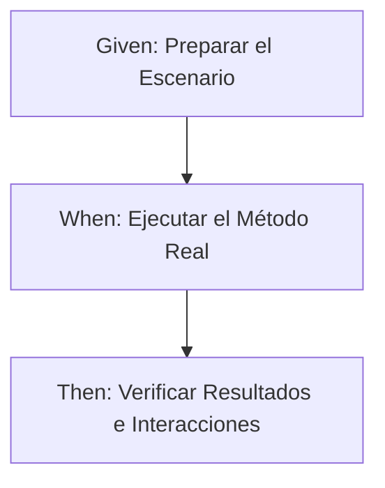

# EXPLICACIÓN: ESTRUCTURA DE MICROSERVICIOS Y PRUEBAS UNITARIAS
## ANÁLISIS DE BOOKING-SERVICE Y GARAGE-SERVICE

Este documento detalla la arquitectura interna de los microservicios `booking-service` y `garage-service`, desglosa los componentes de una prueba unitaria bajo el patrón **Given-When-Then**, y ofrece una guía práctica sobre qué aspectos evaluar al escribir pruebas unitarias para la capa de servicio.

---

## 1. ELEMENTOS DE LOS MICROSERVICIOS

Ambos microservicios siguen una arquitectura en capas común en Spring Boot (Controlador $\rightarrow$ Servicio $\rightarrow$ Repositorio / Cliente de Red), pero difieren en su propósito de negocio y sus integraciones externas.

### A. booking-service (Gestión de Citas)
Este microservicio es responsable de agendar, actualizar, cancelar e inspeccionar las citas de mantenimiento técnico de vehículos en los talleres.

*   **Entidad (`Cita`):** Define el modelo persistido en base de datos. Contiene campos como `id`, `clienteId`, `vehiculoId`, `fechaHora`, `motivo` y el estado de la cita (`EstadoCita`: `AGENDADA`, etc.).
*   **Repositorio (`CitaRepository`):** Interfaz JPA con consultas personalizadas importantes para la lógica de negocio, tales como:
    *   `countByFecha(LocalDate fecha)`: Cuenta cuántas citas hay en un día determinado (límite de 20).
    *   `existsByFechaAndHora(LocalDate fecha, LocalTime hora)`: Verifica si hay choque de horarios.
    *   `findByVehiculoId(Long vehiculoId)`: Recupera citas específicas de un vehículo.
*   **Servicio (`CitaService`):** Orquesta la lógica y validaciones críticas (ej. límites diarios de agendamiento y disponibilidad).
*   **Controlador (`CitaController`):** Expone los endpoints REST bajo `/api/v1/citas` y utiliza un `CitaModelAssembler` para retornar representaciones HATEOAS/HAL de las citas.
*   **Clientes externos (`GarageClient`):** Feign Client (o cliente HTTP similar) que se conecta con `garage-service` para verificar si un `clienteId` y un `vehiculoId` realmente existen antes de registrar la cita.
*   **DTOs (`CitaRequestDTO`, `ClienteDTO`, `VehiculoDTO`):** Records/clases Java que encapsulan e intercambian información inmutable.

### B. garage-service (Ficha del Taller / Vehículos y Clientes)
Este microservicio funciona como la base de datos de registro de fichas técnicas de los clientes y sus vehículos asociados en la red de talleres.

*   **Entidades (`Cliente` y `Vehiculo`):** Relación uno a muchos (`@OneToMany`). Un `Cliente` es dueño de varios `Vehiculos`.
*   **Repositorios (`ClienteRepository` y `VehiculoRepository`):**
    *   `findByDocumentoIdentidad(String documentoIdentidad)`: Evita el duplicado de clientes por identificación fiscal/RUT.
    *   `findByPatente(String patente)`: Asegura la unicidad de las patentes vehiculares en el garage.
*   **Servicio (`GarageService`):** Lógica CRUD de creación de clientes y vehículos, asociando vehículos a un dueño específico y asegurando que no se registren patentes repetidas.
*   **Controlador (`GarageController`):** Expone endpoints REST para dar de alta clientes y vehículos.
*   **Clientes externos (`LoyaltyClient`):** Cliente Feign que se comunica con el microservicio de lealtad (`loyalty-service`) para inicializar un perfil de beneficios en cuanto se registra un nuevo cliente (`inicializarPerfilLealtad`).

---

## 2. ANÁLISIS DE UNA PRUEBA UNITARIA (GIVEN-WHEN-THEN)

Una prueba unitaria evalúa una **unidad mínima de código en aislamiento** (generalmente un método de la capa de servicio). Para garantizar que no toque base de datos real ni servicios externos de red, las dependencias inyectadas en la clase por probar se sustituyen por **Mocks** (simuladores configurables) con Mockito.

La estructura estándar recomendada es **Given-When-Then** (patrón AAA: Arrange-Act-Assert):



### A. GIVEN (Arrange / Configurar el escenario)
Define las precondiciones, crea los objetos de prueba y preconfigura el comportamiento de los Mocks.
*   **Mocks de lectura:** Si el método del servicio llama a `repository.findById()`, debes decirle al mock qué retornar:
    ```java
    when(clienteRepository.findById(1L)).thenReturn(Optional.of(clienteExistente));
    ```
*   **Mocks de escritura:** Si guarda en base de datos, simula el retorno del objeto guardado con su ID autogenerado:
    ```java
    when(repository.save(any(Cita.class))).thenReturn(citaGuardada);
    ```
*   **Mocks de métodos void o clientes externos:**
    ```java
    doNothing().when(loyaltyClient).inicializarPerfilLealtad(1L);
    ```

### B. WHEN (Act / Ejecución)
Es la invocación directa al método real del servicio que se quiere testear.
```java
Cita resultado = citaService.agendarCita(citaRequestValida);
```
En caso de probar flujos alternativos o de error (excepciones), el "When" y el "Then" se evalúan de forma conjunta usando `assertThrows`:
```java
RuntimeException exception = assertThrows(RuntimeException.class, () -> {
    garageService.registrarCliente(dtoConDocumentoDuplicado);
});
```

### C. THEN (Assert & Verify / Verificación)
Comprueba que los efectos secundarios, retornos e interacciones hayan sido los esperados.
1.  **Verificación de Estado (Asserts):** Compara los valores retornados con los esperados.
    ```java
    assertNotNull(resultado);
    assertEquals(Cita.EstadoCita.AGENDADA, resultado.getEstado());
    ```
2.  **Verificación de Comportamiento (Verify):** Asegura que los métodos clave de los mocks se llamaron (o no) con los parámetros adecuados.
    ```java
    // Verifica que se llamó exactamente 1 vez a guardar en BD
    verify(repository, times(1)).save(any(Cita.class));
    
    // Verifica que NO se llamó a inicializar perfil si la validación previa falló
    verifyNoInteractions(loyaltyClient);
    ```

---

## 3. EN QUÉ FIJARSE AL PROBAR MÉTODOS DEL SERVICE

Al escribir pruebas unitarias para `CitaService` y `GarageService`, debes estructurar tus casos de prueba enfocándote en los siguientes puntos críticos:

### A. Dependencias y Mocks Requeridos
Identifica con qué interactúa el método. Cada dependencia inyectada con `@Autowired` o Lombok en la clase del servicio debe declararse como `@Mock` en la clase de test:
*   En `CitaServiceTest`: Debes mockear `CitaRepository` y `GarageClient`.
*   En `GarageServiceTest`: Debes mockear `ClienteRepository`, `VehiculoRepository` y `LoyaltyClient`.

### B. Validación de Reglas de Negocio (RN)
Cada regla lógica que contenga un `if` o lance una excepción en el servicio debe contar con su propio caso de prueba dedicado.
*   **Para `CitaService.agendarCita()`:**
    1.  **RN-01 (Existencia):** Probar qué pasa si `garageClient.existeCliente()` devuelve `false`. (Debe lanzar `ResponseStatusException` de HTTP 400 y nunca llamar a `repository.save()`).
    2.  **RN-03 (Horario ocupado):** Probar si `repository.existsByFechaAndHora()` es `true`. (Debe lanzar `HorarioOcupadoException` y no guardar).
    3.  **RN-04 (Límite diario):** Probar si `repository.countByFecha()` devuelve `20`. (Debe lanzar `HorarioOcupadoException`).
    4.  **Camino Feliz:** Probar si todos los chequeos dan luz verde. (Debe guardar y retornar la cita).
*   **Para `GarageService.registrarCliente()`:**
    1.  **RN-Duplicado:** Probar si `clienteRepository.findByDocumentoIdentidad()` retorna un cliente existente. (Debe lanzar `RuntimeException` y nunca inicializar perfil de lealtad).
    2.  **Camino Feliz:** Probar registro correcto. (Debe guardar el cliente y gatillar la llamada a `loyaltyClient.inicializarPerfilLealtad()`).

### C. Aislamiento de Entorno (Evitar `@SpringBootTest`)
Para pruebas unitarias, **nunca** uses `@SpringBootTest` ni `@ActiveProfiles`. Estas anotaciones levantan el contexto de Spring completo, arrancan contenedores de bases de datos y ralentizan la ejecución del CI/CD. 
Utiliza en su lugar:
```java
@ExtendWith(MockitoExtension.class)
class MiServicioTest { ... }
```
Esto inicializa únicamente los Mocks de Mockito en memoria y acelera la ejecución del test a milisegundos.

### D. Casos Límite (Edge Cases) y Tipos de Assertions
*   Si validas un límite superior de 20 citas, prueba con un conteo previo de **19** (debe pasar con éxito) y con un conteo previo de **20** (debe arrojar error).
*   Utiliza `assertThrows(TipoDeExcepcion.class, ...)` para capturar errores de negocio de forma controlada y comprueba el mensaje exacto con `assertEquals("Mensaje esperado", ex.getMessage())`.
